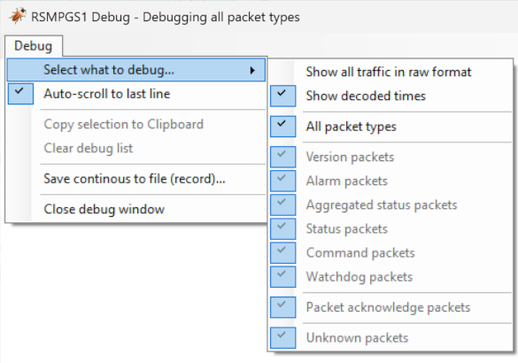

Manual RSMPGS1 simulator
========================

.. sectnum::

.. contents::

Introduction
------------
This document describes the interface simulator for Road side systems which are
communicating with RSMP.

Terms & definitions
-------------------

=======   ===========================================
Term      Description
=======   ===========================================
HMI       Human Machine Interface (User interface)
SCADA     Supervisory Control And Data Acquisition
OP        Operating Panel
GUI       Graphical User Interface
RSMP      RoadSide Messaging Protocol
JSon      JavaScript Object Notation
TCP       Transfer Control Protocol
IP        Internet Protocol
RSMPGS1   Interface simulator for Roadside Equipment
RSMPGS2   Interface simulator for supervision system
=======   ===========================================

Installation
------------
Start installation by running ``RSMPGS1_1_0_5_Setup.exe``.

The installation program recommends a suitable folder.

RSMPGS1 is written in C# with Microsoft Visual Studio 2015 and requires
.NET Framework 4.6.1.

The following files and folders which are included in the RSMPGS1 installation.
All files and folders are placed under the installation folder.

==========================  ==============================================
Filename                    Description
==========================  ==============================================
``RSMPGS1.exe``             Main program
``.\Settings\RSMPGS1.INI``  Configuration of RSMPGS1
``.\Objects``               Reference files (example). SXL in CSV format
``.\YAML``                  Reference files (example). SXL in YAML format
``.\Documents``             Manuals, etc
==========================  ==============================================

Configuration
-------------

RSMPGS1.ini
^^^^^^^^^^^

The RSMPGS1 configuration is saved in ``.\Settings\RSMPGS1.INI``.

The INI-file has the following parameters in the ``[RSMP]`` section:

**IPAddress**

IP-address and port number at the location of the supervision system,
e.g 192.168.123.20:12666. A DNS name can also be used.

**ReconnectInterval**

Reconnection attempts will use this interval if automatic reconnection has been
selected in the interface. Interval in milliseconds.

**MaxDebugLines**

Number of lines shown in the Debug-forms.

**DaysToKeepLogFiles**

Number of days before the log files are automatically deleted.

**PacketTimeout**

Packet timeout in milliseconds. The time which RSMPGS1 waits for ack/nack before
an error message are written in the system log and the packet is resent.

**WatchdogInterval**

This interval will be used if cyclical watchdog has been selected in the user
interface. The interval is in milliseconds.

**WatchdogTimeout**

The watchdog timeout in milliseconds, set to 0 to ignore failed watchdogs.

**MaxEventsPerObject**

Max number of events in the event views per object (oldest will be removed).

The INI-file has the following parameters in the ``[AggregatedStatus]``
section:

**BitText_1..9**

Texts which are associated (and presented in the user interface) in tab
*Aggregated Status.*

The INI-file also has a ``[Main]`` section where for instance the current user
interface configuration is saved.

SXL
^^^

RSMPGS1 supports both Excel-based SXL and YAML-based SXL.

**CSV format**

RSMPGS1 cannot read the Excel format which SXL is saved in. Every sheet of the
SXL file (Excel) must be saved as a separate comma separated text file (CSV or
SKV file).

It is appropriate to name the file according to the content, e.g alarm.csv,
41101.csv, commands.csv etc. The files are saved in the sub-folder
``.\Objects``. If the folder does not exist, it must be created. RSMPGS2 will
create the folder automatically the first time the program is started. When the
program is installed, several example files are included.

Do not forget to change or add a new revision number and save the first sheet
again if any change is made. RSMPGS1 will point out if any file in
``.\Objects`` is changed without revision number change.

It is important that the SXL format follows the template and the
recommendations, otherwise RSMPGS1 won’t be able to read the information
correctly. See the functional specification for more information on how to
manually edit the CSV/SKV files if needed.

**YAML format**

The YAML format is more easy to read from code – yet still maintaining a human
readable format.

RSMPGS1 may import the YAML found in GitHub –
`rsmp-nordic/rsmp_schema <https://github.com/rsmp-nordic/rsmp_schema>`_.
But RSMPGS1 requires an extended format which includes the objects as well.
An example is saved in the sub-folder ``.\YAML``.

Starting the simulator
----------------------
When RSMPGS1 is started it will automatically use the installation folder as
the project folder. RSMPGS1 is expecting to find the Settings folder in the
project folder.

If not already present, RSMPGS1 will create the LogFiles folders.

The program can also be started with the startparameter ``/path`` to use
another project folder, e.g to use ``c:\RoadSide\TestConfig1`` as a project
folder: ``RSMPGS1.EXE /path:c:\RoadSide\TestConfig1``

In this way, it is possible to create shortcuts for an unlimited number of
projects. These projects can also be run simultaneously. The program will by
default automatically try to find an Objects folder located in the project
folder and scan it fo SXL (CSV) files, then loading them.

Main Window
-----------
The program has two forms, one main window and one (or several) debug windows.

.. image:: img/main_window.png
   :align: left
   :width: 100%
   :alt: Main window

At the top right, there is a presentation of connection status to the
supervision system. If the box is green, the connection is ok. The IP address
is also showing. When connection attempts are performed, the box is grey.

If there is no connection the box is blue.

Sites and objects
^^^^^^^^^^^^^^^^^
At program startup the entire SXL is read from ``.\Objects`` and an
hierarchical tree structure is built to the left. Clicking on an object group
or object selects what should be presented on the tabs to the right.

.. image:: img/sites_and_objects.png
   :align: left
   :alt: Sites and objects

When hovering over a node and ’Show all node info in Tooltip’ is selected,
tooltip will show all information that RSMPGS1 have been able to read about
respective objects.

System log
^^^^^^^^^^
Down to the left, the system log is shown which display all occurring events,
for instance if messages are received, if errors occur or a connection is
established.

All events in the system log are continuously saved in ordinary text files in
the folder ``.\LogFiles\SysLogFiles`` and marked with today’s date. The files
are automatically deleted when they are too old (according to settings in
RSMPGS1.INI).

The System log will show different status icons, depending of the message itself
(info, warning, error).
If View only failed packets is selected, the System log will only show failed
packets. Click Clear to empty the System log list. The System log files will
not be deleted.

File
^^^^

.. image:: img/file_csv.png
   :align: left
   :alt: Load project from CSV-files

**Load projects from – CSV-files**

Select folder where the SXL-objects (CSV-files) reside

**Load projects from – YAML-file**

Select the YAML-file where the SXL-objects reside

Loading new objects is only available if the simulator is disconnected

**Debug - Create new debug window**

Creates a new debug window. Any number of debug forms can be created, but it
will affect performance.

**Debug -Tile all debug windows**

Moves all debug forms to the right of RSMPGS1 (if there is space) and puts them
in a line.

**Debug - Close all debug windows**

Closes all debug forms.

**Debug - Store base64 updates**

If checked, all incoming base64 encoded updates (commands) will be stored in the
*DebugFiles* folder. The files will be named ``Base64_`` followed by date/timestamp.

**Exit**

Closes RSMPGS1. Some process data is saved. Form settings (positions and what is
marked) is saved in RSMPGS1.INI, so it looks the same at next program start.

Process Image
^^^^^^^^^^^^^
The process image contains information about status, commands and alarms.

.. image:: img/rsmpgs1_process_image.png
   :align: left
   :alt: Process image

**Random update all subscriptions**

If a client is subscribing to status updates, this selection can randomly change
them. If the subscriptions are updated by events, the new values are sent
directly up to the client otherwise they will be transmitted when it´s time
according to UpdateRate.

The values of data type boolean, string and real will be updated to true/false,
"0"/"1" and -1000.0..1000.0 respectively.  All other data types will be updated
to -1000..1000.

**Reset Alarm, Status, Aggregated and Command objects**

Removes all alarms, status, aggregated status and command values. This can be
done only when we are not connected.

**Random update all Status values**

Randomly change all Status values. This can be done only when we are not
connected. Se data type value ranges above (Random update all subscriptions)

**Save Process data to file...**

Process data could be save to any file for later use. The process data file has
a file ending of .dat but is basically a text file. The default process data
file is the ProcessImage.dat file.

**Load Process data from file...**

Loads the process data file

**Clear automatically saved process data**

Removes the default process data file ProcessImage.dat.

Connection
^^^^^^^^^^
Functions that are related to the supervision system connection is handled
here. RSMPGS1 is acting as a server when it comes to providing data, alarms
etc. But in connection terms, it is a client (TCP socket client).

The reason for this is that it´s easier to configure a firewall which is
centrally located and where the supervision system likely is placed, rather
than the opposite. Roadside equipment can consequently be situated behind a
simpler firewall.

.. image:: img/rsmpgs1_connection.png
   :align: left
   :alt: Connection

**Connect automatically**

Select to let RSMPGS1 make automatic connection attempts to the supervision
system. In RSMPGS1.INI, the interval for connection attempts are configured.

**Connect now**

Immediately performs a connection attempt, which is done regardless if
’connect automatically' has been marked or not.

**Disconnect**

Closes the connection. If *connect automatically* is enabled, a connection
attempt will be performed within the stated interval.

.. image:: img/watchdog.png
   :align: left
   :alt: Send watchdog

**Send options – Send watchdog packet now**

Sends a watchdog package

**Send options – Send some random crap**

To test the resilience of supervision system regarding incoming junk data. It
randomly produces 2048 bytes between 0x00..0xff. Just like an ordinary Json
package it is terminated with 0xc0 (formfeed).

**Send options – Disable Nagle algorithm (send coalescing)**

This alternative affects the algorithm usually used in TCP to make the sending
of many small packets more efficient. Ordinarily these are grouped together in
larger packages.

RSMPGS1 is buffering all JSon packages with the C# function
NetworkStream.Write() in two calls, where the first is the serialized data and
the last is the packet termination character 0x0c (fromfeed).

If the algorithm is shut off, there will always be two packets out on the
network. The purpose is, just like the next function, to test the buffer
algorithm and packet decoding of supervision system.

**Send options – Split packets**

This alternative splits all packets randomly and sends them in small packets,
1..10 bytes each and 10 ms break between each packet. The purpose is to test
the buffer algorithm and packet decoding, which are common error causes, and
which may be hard to detect.

View
^^^^

.. image:: img/rsmpgs1_view.png
   :align: left
   :alt: View

**Always show group headers**

If a parent node is selected in the Sites and Objects list view all its
children will populate the listview in the selected tab (Alarms, Status,
Commands). To separate them they will be grouped and there will be a group
header. If only one child is selected by default the group header is not shown
but will be shown if it is selected here.

**Clear Alarm Events list**

This will clear the alarm event list (it does not change any status)

Generic
^^^^^^^

Various information concerning the connection to the supervision system is
configured here.

.. image:: img/rsmpgs1_generic.png
   :align: left
   :width: 100%
   :alt: Generic

When RSMPGS1 is connected to the supervision system, information about SXL and
the RSMP-interface version is sent over for the software to determine whether
communication is possible or not.

**Active SXL (SUL) version to be used when connecting**

SXL version which is sent over via the protocol when connection is made.

**SXL (SUL) version found in file**

SXL version which is found in reference files in ``.\Objects`` folder.

**Always use SXL (SUL) version from file (if found)**

Select to always use version number from the SXL files in protocol negotiation.

**Automatically load last objects at startup**

If selected RSMPGS1 will load the most recent used SXL object files/file at
startup.

**Automatically load process data at startup**

Select to always load the last roadside data from ProcessImage.dat at startup

**Automatically save process data on exit**

Select to always save the last roadside data to ProcessImage.dat when exiting
RSMPGS1

**When loading... Alarm status**

Select to load last Alarm status from ProcessImage.dat during startup (if
Automatically load process data at startup is selected)

**When loading... Aggregated status values**

Select to load last Aggregated status from ProcessImage.dat during startup (if
Automatically load process data at startup is selected)

**When loading... Status values**

Select to load last Status values from ProcessImage.dat during startup (if
Automatically load process data at startup is selected)

**Encryption protocols**

The RSMP protocol specification defines it is possible to use encryption (from
version 3.1.3) based upon SSL 3.0 or TLS 1.0. As SSL 3.0 have been deprecated
by the Internet Engineering Task Force (IETF) the simulator only supports the
never TLS protocols.

*Default* will let the OS select the .NET version most suitable protocol.

The simulator does not look in the server's certificate store (beside to
validate the CA), the certificate to use must be pointed out by the server.
The idea is that the simulator should be used for testing a specific certificate.
To enable encryption it must be selected in the RSMP tab.

**Server name**

The server name is essential to validate the server certificate and is part of
the negotiation process.

**Ignore certificate errors**

During the negotiation of the encrypted connection the system log will show some
info. If there are any certificate errors the connection will be closed unless
this choice is ticked.

**Check certificate against certificate revocation list**

Determines if the certificate should be checked against the revoked certificates
and their CA's

**Authenticate as client using this certificate file**

If also the client should identify itself using a certificate it may be selected
here using the Browse button. If it is a pfx-file the simulator will also ask
for a password. Be aware of that the password is stored Base-64 encoded in the
INI-file.

RSMP
^^^^
RSMP protocol specific settings have an own tab. The simulator could be used
with RSMP protocol versions 3.1.1..3.1.5

.. image:: img/rsmp.png
   :align: left
   :width: 100%
   :alt: View

**Behaviour**

The protocol behaviour could be adjusted to test different functionality. The
settings could be changed  for each version of the RSMP protocol (not common
settings). If any setting deviate from the default setting, it will be
indicated by a red background.

The RSMP versions the simulator will allow and use when connecting are selected
by the first row.

The setting *Use strict and unforgiving protocol parsing* enables a more strict
mode, where amongst other protocol checking all JSon names.

The setting *Use case sensitive lookup for object id's and references* enables
case sensitive check for componentId, statusCodeId, alarmCodeId, commandCodeId
and "name" in arguments/return values.

The setting *Use case sensitive value* enables case sensitive checks for the
values in alarms, statuses and commands.

Each individual setting is not explained in this document, since they mostly
reflects the version document history of the RSMP protocol and the protocol
specification itself, hence are pretty much self-explanatory.

**Connection statistics**

Some statistics (sent bytes/packets etc) are viewed here. Select Clear to reset
them.

Alarms
^^^^^^

Alarms are read from SXL and created for each object type, which means the same
AlarmCodeId may occur on several objects.

.. image:: img/rsmpgs1_alarms.png
   :align: left
   :width: 100%
   :alt: Alarms

At the bottom, *Timestamp* and *MsgId* are shown for occurred events.

Select the alarm that should be tested and select from the pop-up menu with the
right button.

**Activate**

Sets the alarm in active status (alternatively Inactive) and creates an
Alarm message with ``aSp == "Issue"``. The alarm automatically gets the status
Acknowledge = false when activated.

**Acknowledge**

Sets the alarm in acknowledged status and creates an Alarm-message with
``aSp == "Acknowledge"``.

**Suspend**

Sets the alarm in suspended status (alternatively not suspended) and creates an
Alarm-message with ``aSp == "Suspend"``.

**Alarm Events**

Alarm event history, *Timestamp*, *MsgId*, *AlarmCodeId* and *Event* are shown
for sent and received events.

Aggregated status
^^^^^^^^^^^^^^^^^
Aggregated status is normally compiled on each grouped object of the road side
equipment. RSMPGS1 lacks that kind of dynamic, the reason for this is that it
is hard to keep track of which objects that are put in alarm mode.
Consequently, status is configured manually.

.. image:: img/rsmpgs1_aggregated_status.png
   :align: left
   :width: 100%
   :alt: Aggregated Status

**Status bits**

Double click to change bit status, on or off. Bit-texts are sourced from
RSMPGS1.INI. The colors follow NTS standard.

**Functional position**

Click to choose a Functional Position. The empty field set Functional Position
to null.

**Functional state**

Click to choose a Functional State. The empty field set Functional State to
null.

Both FunctionalPosition and FunctionalState are read from SXL. Any ’-’ are
automatically removed.

**Send aggregated Status update**

Send an ’AggregatedStatus’ message.

**Automatically send update when anything is changed Status update**

Select to send an ’AggregatedStatus’ message each time something has been
changed.

Status
^^^^^^
Status is sent to the supervision system after requests or cyclically/at
changes when the supervision system is subscribing to them.

.. image:: img/rsmpgs1_status.png
   :align: left
   :width: 100%
   :alt: Status

To change status, double click in the ’Status’ column at the value that should
be changed. At startup, a question mark is shown which will result in that the
value which are sent up becomes null (unknown). If the value is manually
changed, it will get the status ’recent’.

Values can be set to any value, all values are sent up as ’string’, which means
that it can be tested how the supervision system reacts to invalid values.

If the data type is ’base64’, an extra button ’Browse’ will be shown when
double clicking ’status’ and a file can be selected, for example a bitmap.

Alternatively, the path to the file can be entered. If there is at least one
``\`` in the status field RSMPGS1 assumes that it is a file path/name and that
the file should be base64-encoded and sent. If not, the field is sent as-is.

Please note that RSMPGS1/RSMPGS2 has limited buffer size and it cannot receive
files larger than 2 MB.

In subscription mode, new status is sent directly when it has has changed if
the subscription parameter UpdateRate is set to 0, in other cases when the
interval expires next time.

Commands
^^^^^^^^
The Commands tab displays the values which have been sent from the supervision
system. At startup, only question marks are shown.

.. image:: img/rsmpgs1_commands.png
   :align: left
   :width: 100%
   :alt: Commands

RSMPGS1 makes a basic check that the value is kept within the limits of the
data type. If the value seems invalid, an error message is shown in the system
log.

Test send
^^^^^^^^^
JSon is text based and in this tab text files can be sent as is. The files may
be JSon debug data from the debug-forms.

.. image:: img/test_send.png
   :align: left
   :width: 100%
   :alt: Test send

There are two textboxes which can be used simultaneously. In the textboxes, it
is possible to copy/paste text as desired.

**Send above package**

Sends Json message in textbox above. The ending 0x0c (formfeed) is
automatically added at the end.

Please note that RSMPGS1 does not remove CR/LF or tabs in the text before it is
sent.

**Browse**

Open and read a text file inte the above text form.

Buffered messages
^^^^^^^^^^^^^^^^^
When disconnected RSMPGS1 may buffer messages and send when reconnecting.

.. image:: img/buffered.png
   :align: left
   :width: 100%
   :alt: Buffered messages

**Create**

Creates the selected message type and queue it. The number of messages to
create may be set in the text box. RSMGS1 have no upper buffered message limit
(memory only) but max 30’000 messages may be created per click on the Create
button.

Buffered events may be deleted using the buttons to the right.

**Buffered count**

Indicates the total number of buffered events

**Don't show these packets in system log if they are more than 10**

If a lot of buffered messages are to be sent when connected, the system log
will be flooded and take some time to fill. Ticking this box will significally
improve speed.

Debug form
----------
The Debug form shows sent and received data more or less formatted depending on
chosen display format.

.. image:: img/debug.png
   :align: left
   :width: 70%
   :alt: Debug window

The red texts are messages which are received, green texts are the ones which
are sent out. The time stamp has millisecond resolution which is shown if the
column is expanded somewhat.

If show raw data is not selection, then RSMPGS1 will format the text for better
readability. If there are CR/LF and tabs in the received Json, these control
characters will be used to increase readability. If not, RSMPGS1 will use a set
of simple rules to format the text.

RSMPGS1 is always removing CR/LF, tabs and finalizing form feed (FF) before
deserializing.

Time stamps are also presented decoded in both UTC and local time.

**Select what to debug – Show all traffic in raw format**

Shows all packets unformatted in raw data format. ASCII codes which RSMPGS1 is
not certain if they are writable are shown as <ASCII> i hex-format, e. g.
<0x0c> for formfeed.

**Select what to debug – All packet types**

Shows all packet types.

**Select what to debug –Version packets, Alarm Packets etc…**

If not all packet types are selected to be shown, one packet type or a
selection of packet types can be selected for display. Because that it is
possible to display any number of debug formulas, it is possible to have
different types of formulas for every packet type.

**Copy selection to Clipboard**

In the debug window, it is possible to select one or more lines and copy to the
clipboard with this function. RSMPGS1 delimits every line with CR/LF
(0x0d/0x0a) as text in the clipboard.

Every column is delimited with a tab (0x09).

**Clear debug list**

Empties the debug form.

**Save continuous to file (record)…**

Begins a recording to file from this specific debug window.

File name and file location are determined by the user. RSMPGS1 suggests the
folder name ``\LogFiles\DebugFiles.``

If the file does not exist it will be created and filled up with new debug
data. The same data which is presented in the form is stored in the file. The
file is an ordinary text file and will be flushed every 100 milliseconds.
Because of this, it can be copied or opened (only for reading) with complete
contents without having to be closed first.

To close the file and stop recording this option must be unchecked (it will be
checked when the file is opened and recording is in progress).

**Close debug form**

Closes the debug window.
